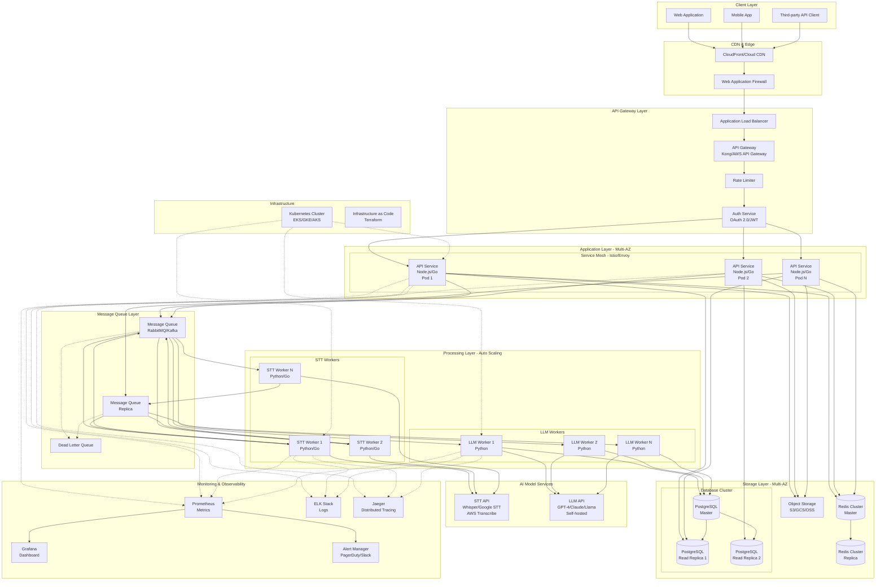
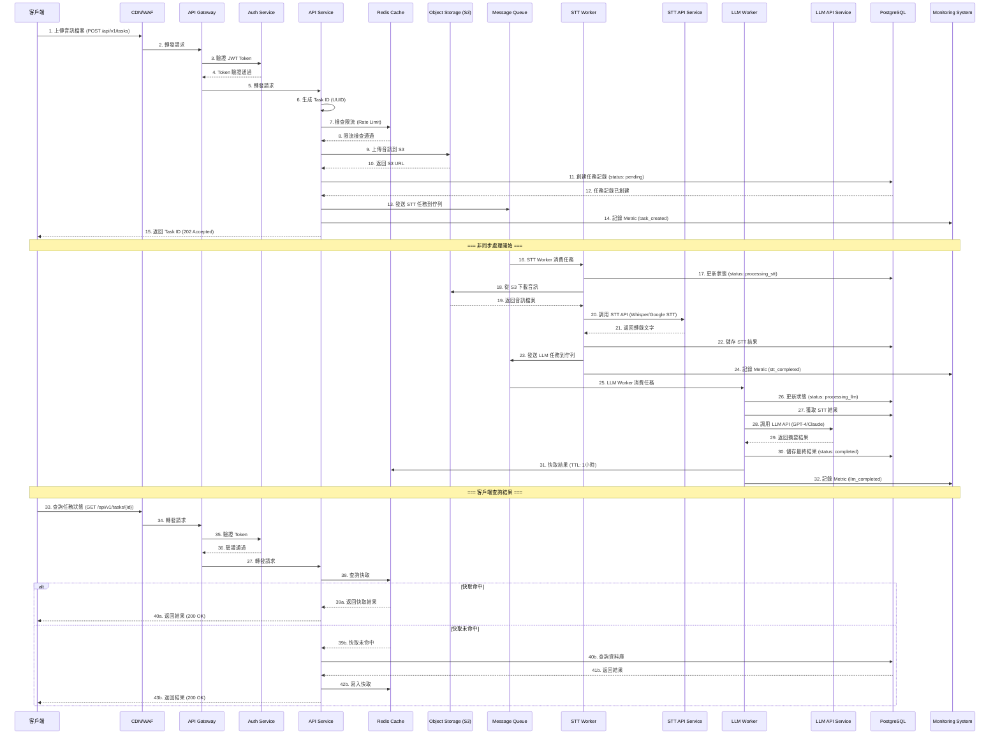
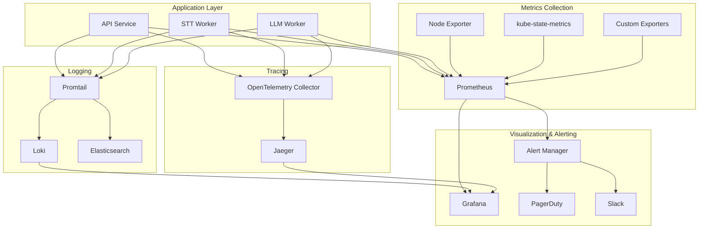

# AI Processing Platform — System Architecture Design

## 目錄
1. [系統概述](#系統概述)
2. [架構設計](#架構設計)
3. [技術選型與理由](#技術選型與理由)
4. [架構特性說明](#架構特性說明)
5. [維運與部署](#維運與部署)
6. [監控與可觀測性](#監控與可觀測性)
7. [安全性考量](#安全性考量)
8. [未來擴展性](#未來擴展性)

---

## 系統概述

### 專案目標
設計一個高可用、可擴展的 AI 任務處理平台，支援語音轉文字（STT）、大型語言模型（LLM）文字摘要，以及結果查詢等服務。系統需要處理高併發請求，並具備完善的監控、容錯與可觀測性機制。

### 核心業務流程
```
使用者上傳音訊 → STT Service 轉文字 → LLM Service 摘要 → 儲存結果 → 查詢結果
```

### 設計原則
- **高可用性（High Availability）**: 99.9% 可用性目標
- **可擴展性（Scalability）**: 支援水平擴展，應對流量暴增
- **容錯性（Fault Tolerance）**: 服務降級、自動重試、熔斷機制
- **可觀測性（Observability）**: 全鏈路追蹤、指標監控、日誌聚合
- **安全性（Security）**: 資料加密、身份驗證、權限控制

---

## 架構設計

### 系統架構圖



### 任務循序圖（Sequence Diagram）



### 各服務的邏輯邊界與職責

#### 1. **Client Layer (客戶端層)**
- **職責**: 提供使用者介面，支援 Web、Mobile、第三方 API 客戶端
- **技術**: React/Vue.js (Web), Swift/Kotlin (Mobile), REST/GraphQL Client
- **邊界**: 僅負責展示與使用者互動，不處理業務邏輯

#### 2. **CDN & Edge Layer (內容分發層)**
- **職責**:
  - 靜態資源分發
  - DDoS 防護
  - WAF 規則過濾
  - SSL/TLS 終止
- **技術**: AWS CloudFront, Cloudflare, GCP Cloud CDN
- **邊界**: 處理邊緣快取與安全過濾，不處理動態業務邏輯

#### 3. **API Gateway Layer (API 閘道層)**
- **職責**:
  - 請求路由與負載平衡
  - API 版本管理
  - 限流與配額控制
  - 身份驗證與授權
  - API 文件 (OpenAPI/Swagger)
- **技術**: Kong, AWS API Gateway, Azure API Management
- **邊界**: 統一入口，不處理具體業務邏輯

#### 4. **Application Layer (應用服務層)**
- **API Service 職責**:
  - 處理 HTTP 請求
  - 業務邏輯編排
  - 任務建立與狀態管理
  - 檔案上傳協調
  - 結果查詢
- **技術**: Node.js (Express/Fastify), Go (Gin/Echo)
- **邊界**: 負責業務流程編排，不直接處理 AI 運算

#### 5. **Message Queue Layer (訊息佇列層)**
- **職責**:
  - 非同步任務分發
  - 流量削峰
  - 服務解耦
  - 任務重試機制
  - 死信佇列處理
- **技術**: RabbitMQ, Apache Kafka, AWS SQS
- **邊界**: 僅負責訊息傳遞，不處理任務邏輯

#### 6. **Processing Layer (處理層)**

##### **STT Worker**
- **職責**:
  - 從佇列消費 STT 任務
  - 調用 STT API 服務
  - 錯誤處理與重試
  - 結果驗證與儲存
- **技術**: Python (Celery), Go
- **邊界**: 僅處理語音轉文字，完成後傳遞給 LLM Worker

##### **LLM Worker**
- **職責**:
  - 從佇列消費 LLM 任務
  - 調用 LLM API 服務
  - Prompt 工程與優化
  - 結果後處理與儲存
- **技術**: Python (LangChain, Celery)
- **邊界**: 僅處理文字摘要，不處理語音相關邏輯

#### 7. **AI Model Services Layer (AI 模型服務層)**

##### **STT API Service**
- **職責**: 提供語音轉文字能力
- **選項**:
  - **雲端服務**: AWS Transcribe, Google Cloud Speech-to-Text, Azure Speech
  - **自架服務**: OpenAI Whisper, Nvidia NeMo
- **邊界**: 純 AI 推論服務，不處理業務邏輯

##### **LLM API Service**
- **職責**: 提供文字摘要能力
- **選項**:
  - **雲端 API**: OpenAI GPT-4, Anthropic Claude, Google Gemini
  - **自架模型**: Llama 3, Mistral (使用 vLLM, TGI 部署)
- **邊界**: 純 AI 推論服務，不處理業務邏輯

#### 8. **Storage Layer (儲存層)**

##### **PostgreSQL (主要資料庫)**
- **職責**:
  - 任務狀態持久化
  - 使用者資料管理
  - 轉錄與摘要結果儲存
  - 交易處理
- **架構**: Master-Slave 讀寫分離
- **邊界**: 僅負責結構化資料儲存

##### **Redis (快取層)**
- **職責**:
  - 任務狀態快取
  - Session 管理
  - 限流計數器
  - 分散式鎖
- **架構**: Redis Cluster (Multi-Master)
- **邊界**: 僅負責暫時性資料與快取

##### **Object Storage (物件儲存)**
- **職責**:
  - 音訊檔案儲存
  - 大型文字檔案儲存
  - 靜態資源儲存
- **技術**: AWS S3, Google Cloud Storage, MinIO
- **邊界**: 僅負責非結構化資料儲存

#### 9. **Monitoring & Observability Layer (監控層)**

##### **Metrics (指標監控)**
- **職責**: 收集系統指標、業務指標
- **技術**: Prometheus + Grafana
- **指標類型**:
  - 系統指標: CPU, Memory, Network, Disk I/O
  - 業務指標: 任務數、成功率、處理時間
  - AI 指標: STT/LLM API 延遲、錯誤率

##### **Logging (日誌聚合)**
- **職責**: 集中式日誌管理
- **技術**: ELK Stack (Elasticsearch, Logstash, Kibana) 或 Loki
- **日誌類型**:
  - 應用日誌 (Application Logs)
  - 存取日誌 (Access Logs)
  - 錯誤日誌 (Error Logs)
  - 稽核日誌 (Audit Logs)

##### **Tracing (分散式追蹤)**
- **職責**: 全鏈路請求追蹤
- **技術**: Jaeger, Zipkin, OpenTelemetry
- **追蹤範圍**: 從 API Gateway 到各個微服務的完整請求路徑

##### **Alerting (告警)**
- **職責**: 異常檢測與通知
- **技術**: Prometheus AlertManager, PagerDuty, Slack
- **告警類型**:
  - 系統告警 (高負載、服務宕機)
  - 業務告警 (任務失敗率高、處理時間過長)
  - 安全告警 (異常存取、DDoS 攻擊)

#### 10. **Infrastructure Layer (基礎設施層)**
- **Kubernetes**: 容器編排、自動擴展、服務發現
- **Terraform**: Infrastructure as Code (IaC)
- **Service Mesh (Istio/Linkerd)**: 服務間通訊管理、流量控制、安全
- **邊界**: 提供基礎設施抽象，不涉及業務邏輯

---

## 技術選型與理由

### 1. 程式語言與框架

#### **API Service: Node.js (TypeScript) + Fastify**
**理由**:
- **高效能非同步 I/O**: 適合處理高併發的 API 請求
- **生態系豐富**: npm 套件完善，開發效率高
- **TypeScript**: 類型安全，減少執行時錯誤
- **Fastify**: 比 Express 性能更好，內建 Schema 驗證
- **團隊熟悉度**: Node.js 前後端人才較易招募

**替代方案**: Go (Gin/Echo) - 若需要更極致性能可考慮

#### **STT Worker: Python + Celery**
**理由**:
- **AI 生態**: Python 是 AI/ML 的第一語言
- **Celery**: 成熟的分散式任務佇列框架
- **STT 整合**: 各大 STT API 都有 Python SDK
- **易於整合**: 與 Whisper 等開源模型整合容易

**替代方案**: Go - 若追求極致性能可考慮

#### **LLM Worker: Python + LangChain + Celery**
**理由**:
- **LangChain**: 強大的 LLM 應用框架，簡化 Prompt 工程
- **多模型支援**: 統一介面支援 OpenAI, Anthropic, 本地模型
- **Prompt 管理**: 內建 Prompt Template 與版本控制
- **易於擴展**: 未來可加入 RAG、Agent 等進階功能

### 2. 雲端平台選擇

#### **主選: AWS (Amazon Web Services)**
**理由**:
- **服務完整**: 從基礎設施到 AI 服務一應俱全
- **成熟度高**: 企業級可靠性，全球部署經驗豐富
- **成本優化**: Reserved Instances, Spot Instances 可降低成本
- **AI 服務**: Transcribe (STT), Bedrock (LLM), SageMaker (自架模型)
- **Kubernetes**: EKS (Elastic Kubernetes Service) 託管服務

**關鍵服務**:
- **計算**: EKS (Kubernetes), EC2, Lambda (Serverless)
- **儲存**: S3 (物件儲存), EBS (區塊儲存)
- **資料庫**: RDS (PostgreSQL), ElastiCache (Redis)
- **網路**: CloudFront (CDN), Route 53 (DNS), ALB/NLB (負載平衡)
- **監控**: CloudWatch, X-Ray (分散式追蹤)
- **訊息佇列**: SQS, MSK (Kafka)
- **AI/ML**: Transcribe (STT), Bedrock (LLM), SageMaker

**替代方案**:
- **GCP**: 若需要 Google Cloud Speech-to-Text 或 Vertex AI
- **Azure**: 若企業已有 Microsoft 生態

### 3. 資料庫選擇

#### **主資料庫: PostgreSQL**
**理由**:
- **ACID 保證**: 確保資料一致性
- **JSON 支援**: 靈活儲存 STT/LLM 結果
- **擴展性**: 支援 Partitioning (分區) 與 Sharding (分片)
- **全文搜尋**: 內建 Full-Text Search
- **成熟度**: 企業級穩定性，社群支援好
- **擴充套件**: PostGIS (地理資訊), pgvector (向量搜尋)

**Schema 設計**:
```sql
-- 任務表
CREATE TABLE tasks (
    id UUID PRIMARY KEY DEFAULT gen_random_uuid(),
    user_id UUID NOT NULL,
    status VARCHAR(50) NOT NULL, -- pending, processing_stt, processing_llm, completed, failed
    audio_url TEXT,
    audio_duration_seconds INTEGER,
    created_at TIMESTAMP WITH TIME ZONE DEFAULT NOW(),
    updated_at TIMESTAMP WITH TIME ZONE DEFAULT NOW(),
    completed_at TIMESTAMP WITH TIME ZONE,
    error_message TEXT,
    retry_count INTEGER DEFAULT 0,
    metadata JSONB -- 儲存額外資訊
);

-- STT 結果表
CREATE TABLE stt_results (
    id UUID PRIMARY KEY DEFAULT gen_random_uuid(),
    task_id UUID NOT NULL REFERENCES tasks(id),
    transcription TEXT NOT NULL,
    confidence FLOAT,
    language VARCHAR(10),
    processing_time_ms INTEGER,
    created_at TIMESTAMP WITH TIME ZONE DEFAULT NOW()
);

-- LLM 摘要表
CREATE TABLE llm_summaries (
    id UUID PRIMARY KEY DEFAULT gen_random_uuid(),
    task_id UUID NOT NULL REFERENCES tasks(id),
    summary TEXT NOT NULL,
    model_name VARCHAR(100),
    tokens_used INTEGER,
    processing_time_ms INTEGER,
    created_at TIMESTAMP WITH TIME ZONE DEFAULT NOW()
);

-- 索引優化
CREATE INDEX idx_tasks_user_id ON tasks(user_id);
CREATE INDEX idx_tasks_status ON tasks(status);
CREATE INDEX idx_tasks_created_at ON tasks(created_at DESC);
CREATE INDEX idx_stt_task_id ON stt_results(task_id);
CREATE INDEX idx_llm_task_id ON llm_summaries(task_id);
```

**替代方案**:
- **MySQL**: 若團隊更熟悉 MySQL
- **MongoDB**: 若資料結構極度靈活，但不建議（缺少交易完整性）

#### **快取: Redis Cluster**
**理由**:
- **高效能**: 記憶體操作，微秒級延遲
- **資料結構豐富**: String, Hash, List, Set, Sorted Set
- **持久化**: RDB + AOF 混合模式
- **高可用**: Redis Cluster 支援自動故障轉移
- **分散式鎖**: 實現限流、防重複提交

**使用場景**:
- **任務狀態快取**: 減少資料庫查詢
- **API 限流**: 使用 Token Bucket 或 Leaky Bucket
- **Session 管理**: 分散式 Session 儲存
- **排行榜**: Sorted Set 實現任務處理排行

**替代方案**:
- **Memcached**: 更簡單，但功能較少
- **Hazelcast**: Java 生態較好

### 4. 訊息佇列選擇

#### **主選: RabbitMQ**
**理由**:
- **成熟穩定**: 企業級訊息佇列，經過大量生產驗證
- **AMQP 協議**: 標準化協議，支援多語言
- **靈活路由**: Exchange + Queue 路由機制
- **死信佇列**: 內建 DLQ 處理失敗任務
- **管理介面**: 友善的 Web UI
- **適合任務佇列**: 與 Celery 整合完善

**佇列設計**:
```
stt-queue: 處理 STT 任務
llm-queue: 處理 LLM 任務
dlq-queue: 處理失敗任務
priority-queue: 處理高優先級任務（VIP 使用者）
```

**替代方案**:
- **Apache Kafka**: 若需要更高吞吐量或事件溯源 (Event Sourcing)
- **AWS SQS**: 若完全託管服務，簡化維運
- **NATS**: 若追求極致低延遲

#### **補充選擇: Apache Kafka (用於事件串流)**
**使用場景**:
- **日誌串流**: 應用日誌收集
- **事件溯源**: 記錄所有事件歷史
- **即時分析**: 任務處理指標即時統計
- **資料管道**: 資料同步到資料倉儲

### 5. AI 模型服務部署策略

#### **STT 服務部署方案**

**方案 A: 雲端 API (推薦)**
- **服務**: AWS Transcribe, Google Cloud Speech-to-Text, Azure Speech
- **優點**:
  - 免維運，自動擴展
  - 支援多語言，準確度高
  - 按使用量付費
- **缺點**:
  - 成本較高（長期大量使用）
  - 資料需上傳到第三方
  - 受限於 API 限制

**方案 B: 自架 Whisper (OpenAI)**
- **部署方式**:
  - Kubernetes Deployment + GPU Node (NVIDIA T4/A10/A100)
  - vLLM/TensorRT 優化推論速度
  - Horizontal Pod Autoscaler (HPA) 自動擴展
- **優點**:
  - 成本可控（大量使用時更便宜）
  - 資料自主，符合隱私要求
  - 可客製化優化
- **缺點**:
  - 需維護 GPU 基礎設施
  - 冷啟動較慢
  - 需 MLOps 能力

**推薦策略**:
- **前期**: 使用雲端 API (快速上線)
- **後期**: 混合部署 (常用語言自架，少見語言用雲端 API)

#### **LLM 服務部署方案**

**方案 A: 雲端 API (推薦)**
- **服務**: OpenAI GPT-4, Anthropic Claude, Google Gemini
- **優點**:
  - 模型品質高
  - 免維運
  - 快速疊代
- **缺點**:
  - 成本高
  - Token 限制
  - 資料隱私考量

**方案 B: AWS Bedrock (推薦)**
- **優點**:
  - 多模型選擇 (Claude, Llama, Mistral)
  - 資料不離開 AWS
  - 統一計費
  - Guardrails 內建安全機制
- **適用**: 企業級客戶，需要合規性

**方案 C: 自架開源模型 (Llama 3, Mistral)**
- **部署方式**:
  - vLLM/TensorRT-LLM 部署
  - Kubernetes + GPU Node
  - Model Serving (Triton Inference Server)
- **優點**:
  - 成本可控
  - 完全自主
  - 可微調 (Fine-tuning)
- **缺點**:
  - 模型品質可能不如 GPT-4/Claude
  - 需要強大的 MLOps 團隊
  - GPU 成本高

**推薦策略**:
- **MVP 階段**: 使用 OpenAI/Claude API
- **成長階段**: 遷移到 AWS Bedrock
- **成熟階段**: 混合部署（常用場景自架，複雜任務用雲端 API）

### 6. 容器與編排

#### **Kubernetes (EKS)**
**理由**:
- **業界標準**: 容器編排的事實標準
- **自動擴展**: HPA (Horizontal Pod Autoscaler), VPA (Vertical Pod Autoscaler)
- **自我修復**: 自動重啟失敗的 Pod
- **服務發現**: 內建 DNS 與 Service Discovery
- **滾動更新**: Zero-downtime 部署

**關鍵組件**:
- **Ingress Controller**: Nginx Ingress, AWS ALB Ingress
- **Service Mesh**: Istio (流量管理、安全、可觀測性)
- **Autoscaler**: Cluster Autoscaler, Karpenter (節點自動擴展)
- **Secret 管理**: Sealed Secrets, External Secrets Operator

### 7. 監控技術棧

#### **Metrics: Prometheus + Grafana**
- **Prometheus**: 指標收集與儲存
- **Grafana**: 視覺化與告警
- **Node Exporter**: 系統指標收集
- **kube-state-metrics**: Kubernetes 指標

#### **Logging: ELK Stack / Loki**
- **Loki + Promtail**: 輕量級日誌系統（推薦）
- **ELK**: 功能更強大，但資源消耗較大

#### **Tracing: Jaeger + OpenTelemetry**
- **OpenTelemetry**: 統一的可觀測性框架
- **Jaeger**: 分散式追蹤後端

---

## 架構特性說明

### 1. 可擴展性 (Scalability)

#### **水平擴展策略**

**應用層自動擴展**:
```yaml
apiVersion: autoscaling/v2
kind: HorizontalPodAutoscaler
metadata:
  name: api-service-hpa
spec:
  scaleTargetRef:
    apiVersion: apps/v1
    kind: Deployment
    name: api-service
  minReplicas: 3
  maxReplicas: 100
  metrics:
  - type: Resource
    resource:
      name: cpu
      target:
        type: Utilization
        averageUtilization: 70
  - type: Resource
    resource:
      name: memory
      target:
        type: Utilization
        averageUtilization: 80
  - type: Pods
    pods:
      metric:
        name: http_requests_per_second
      target:
        type: AverageValue
        averageValue: "1000"
```

**Worker 層自動擴展**:
```yaml
apiVersion: autoscaling/v2
kind: HorizontalPodAutoscaler
metadata:
  name: stt-worker-hpa
spec:
  scaleTargetRef:
    apiVersion: apps/v1
    kind: Deployment
    name: stt-worker
  minReplicas: 2
  maxReplicas: 50
  metrics:
  - type: External
    external:
      metric:
        name: rabbitmq_queue_messages
        selector:
          matchLabels:
            queue: stt-queue
      target:
        type: AverageValue
        averageValue: "10" # 每個 Worker 處理 10 個任務時擴展
```

**資料庫層擴展**:
- **讀寫分離**: Master 寫入，多個 Read Replica 查詢
- **連接池管理**: PgBouncer (連接池中介軟體)
- **Partitioning**: 按時間分區 (每月一個分區)
- **Sharding**: 按 user_id 或 region 分片（未來需求）

**訊息佇列擴展**:
- **RabbitMQ Cluster**: 3-5 個節點的叢集
- **Queue Sharding**: 多個佇列分散負載
- **Priority Queue**: VIP 使用者使用高優先級佇列

**應對流量暴增策略**:
1. **預熱機制**: 提前擴展 Pod 數量
2. **流量限流**: API Gateway 層限流
3. **降級服務**: 關閉非核心功能（如詳細日誌）
4. **CDN 快取**: 靜態內容與查詢結果快取
5. **非同步處理**: 高峰時延長處理時間，但保證最終完成

### 2. 容錯性 (Fault Tolerance)

#### **服務層級容錯**

**熔斷機制 (Circuit Breaker)**:
```javascript
// 使用 opossum 實作熔斷器
const CircuitBreaker = require('opossum');

const options = {
  timeout: 3000, // 3 秒超時
  errorThresholdPercentage: 50, // 50% 錯誤率觸發熔斷
  resetTimeout: 30000 // 30 秒後嘗試恢復
};

const breaker = new CircuitBreaker(callSTTService, options);

breaker.fallback(() => ({
  status: 'degraded',
  message: 'STT 服務暫時不可用，已加入重試佇列'
}));

breaker.on('open', () => {
  console.log('熔斷器開啟，停止調用 STT 服務');
  alertManager.send('STT 服務異常，熔斷器已開啟');
});
```

**重試機制**:
```python
# STT Worker 重試邏輯
from tenacity import retry, stop_after_attempt, wait_exponential

@retry(
    stop=stop_after_attempt(3),
    wait=wait_exponential(multiplier=1, min=4, max=10),
    reraise=True
)
def call_stt_api(audio_url):
    try:
        response = stt_client.transcribe(audio_url)
        return response
    except Exception as e:
        logger.error(f"STT API 調用失敗: {e}")
        raise
```

**死信佇列 (Dead Letter Queue)**:
```python
# RabbitMQ DLQ 配置
channel.queue_declare(
    queue='stt-queue',
    durable=True,
    arguments={
        'x-dead-letter-exchange': 'dlx',
        'x-dead-letter-routing-key': 'dlq',
        'x-message-ttl': 3600000  # 1 小時後進入 DLQ
    }
)

# DLQ Worker 處理邏輯
def process_dlq_message(message):
    task_id = message['task_id']
    retry_count = message.get('retry_count', 0)

    if retry_count < MAX_RETRY:
        # 重新加入主佇列
        republish_to_main_queue(message)
    else:
        # 標記為永久失敗
        db.update_task_status(task_id, 'failed')
        alert_admin(f"任務 {task_id} 永久失敗")
```

**健康檢查與自動恢復**:
```yaml
# Kubernetes Liveness & Readiness Probe
apiVersion: v1
kind: Pod
metadata:
  name: api-service
spec:
  containers:
  - name: api
    image: api-service:latest
    livenessProbe:
      httpGet:
        path: /health/live
        port: 8080
      initialDelaySeconds: 30
      periodSeconds: 10
      timeoutSeconds: 5
      failureThreshold: 3
    readinessProbe:
      httpGet:
        path: /health/ready
        port: 8080
      initialDelaySeconds: 10
      periodSeconds: 5
      timeoutSeconds: 3
      failureThreshold: 2
```

**資料備份與災難恢復**:
- **PostgreSQL**: 每日全量備份 + 連續歸檔 (WAL)
- **Redis**: RDB + AOF 混合持久化
- **S3**: 跨區域複製 (Cross-Region Replication)
- **RTO/RPO**:
  - RTO (Recovery Time Objective): < 1 小時
  - RPO (Recovery Point Objective): < 5 分鐘

**多可用區部署**:
```
Region: us-east-1
├── AZ-1a: API (3 Pods), STT Worker (2 Pods), DB Master
├── AZ-1b: API (3 Pods), LLM Worker (2 Pods), DB Replica
└── AZ-1c: API (2 Pods), STT Worker (1 Pod), LLM Worker (1 Pod), DB Replica
```

### 3. 資料一致性 (Data Consistency)

#### **任務狀態機**
```
pending → processing_stt → processing_llm → completed
                ↓                ↓
              failed          failed
```

**狀態轉換保證**:
```sql
-- 使用資料庫交易與樂觀鎖
BEGIN;
  UPDATE tasks
  SET status = 'processing_stt',
      updated_at = NOW(),
      version = version + 1
  WHERE id = ?
    AND status = 'pending'
    AND version = ?;

  -- 檢查是否更新成功
  IF FOUND THEN
    COMMIT;
  ELSE
    ROLLBACK;
  END IF;
```

**冪等性設計**:
```javascript
// API Service 冪等性實作
async function createTask(userId, audioFile, idempotencyKey) {
  // 1. 檢查 idempotency key
  const existing = await redis.get(`idempotency:${idempotencyKey}`);
  if (existing) {
    return JSON.parse(existing);
  }

  // 2. 創建任務
  const taskId = uuidv4();
  await db.transaction(async (trx) => {
    await trx('tasks').insert({
      id: taskId,
      user_id: userId,
      status: 'pending',
      audio_url: await uploadToS3(audioFile)
    });
  });

  // 3. 儲存 idempotency key (24 小時)
  await redis.setex(`idempotency:${idempotencyKey}`, 86400, JSON.stringify({ taskId }));

  return { taskId };
}
```

**分散式鎖**:
```javascript
// 使用 Redlock 防止重複處理
const Redlock = require('redlock');
const redlock = new Redlock([redisClient]);

async function processTask(taskId) {
  const lock = await redlock.lock(`lock:task:${taskId}`, 30000); // 30 秒鎖

  try {
    // 處理任務
    await doProcessing(taskId);
  } finally {
    await lock.unlock();
  }
}
```

**最終一致性策略**:
- **非同步任務**: 允許短暫不一致，但最終保證完成
- **Saga 模式**: 長事務拆分為多個本地事務，失敗時補償
- **Event Sourcing**: 記錄所有事件，可重建狀態

### 4. 延遲與效能 (Latency & Performance)

#### **延遲優化策略**

**API 響應時間優化**:
```
目標: P95 < 200ms, P99 < 500ms

優化手段:
1. Redis 快取 (命中率 > 80%)
2. 資料庫索引優化
3. 連接池管理
4. HTTP/2 或 gRPC
5. 壓縮響應 (gzip/brotli)
```

**非同步任務處理**:
```javascript
// 任務建立立即返回
app.post('/api/v1/tasks', async (req, res) => {
  const taskId = await createTaskInDB(req.body);
  await publishToQueue(taskId);

  // 立即返回 202 Accepted
  res.status(202).json({
    taskId,
    status: 'pending',
    statusUrl: `/api/v1/tasks/${taskId}`,
    estimatedCompletionTime: calculateETA()
  });
});
```

**長輪詢與 WebSocket**:
```javascript
// 選項 1: Server-Sent Events (SSE)
app.get('/api/v1/tasks/:id/stream', async (req, res) => {
  res.setHeader('Content-Type', 'text/event-stream');
  res.setHeader('Cache-Control', 'no-cache');
  res.setHeader('Connection', 'keep-alive');

  const taskId = req.params.id;
  const interval = setInterval(async () => {
    const task = await getTaskStatus(taskId);
    res.write(`data: ${JSON.stringify(task)}\n\n`);

    if (task.status === 'completed' || task.status === 'failed') {
      clearInterval(interval);
      res.end();
    }
  }, 1000);
});

// 選項 2: WebSocket
io.on('connection', (socket) => {
  socket.on('subscribe', (taskId) => {
    socket.join(`task:${taskId}`);
  });
});

// Worker 完成後推送
function onTaskComplete(taskId, result) {
  io.to(`task:${taskId}`).emit('task_update', result);
}
```

**CDN 與邊緣快取**:
```nginx
# CloudFront 快取策略
location /api/v1/tasks {
  proxy_pass http://api-gateway;
  proxy_cache_valid 200 5m;
  proxy_cache_key "$request_uri";
  add_header X-Cache-Status $upstream_cache_status;
}
```

**資料庫查詢優化**:
```sql
-- 1. 索引優化
EXPLAIN ANALYZE
SELECT * FROM tasks
WHERE user_id = ? AND status = ?
ORDER BY created_at DESC
LIMIT 20;

-- 2. 預計算欄位
ALTER TABLE tasks ADD COLUMN estimated_completion TIMESTAMP;

-- 3. Materialized View
CREATE MATERIALIZED VIEW task_statistics AS
SELECT
  user_id,
  COUNT(*) as total_tasks,
  AVG(EXTRACT(EPOCH FROM (completed_at - created_at))) as avg_duration
FROM tasks
WHERE status = 'completed'
GROUP BY user_id;

-- 4. 定期刷新
REFRESH MATERIALIZED VIEW CONCURRENTLY task_statistics;
```

**AI 模型推論優化**:
```python
# STT 優化: 批次處理
@app.route('/stt/batch', methods=['POST'])
def batch_transcribe(audio_urls):
    # 批次推論降低延遲
    results = whisper_model.transcribe_batch(audio_urls, batch_size=8)
    return results

# LLM 優化: Streaming
@app.route('/llm/stream', methods=['POST'])
def stream_summary(text):
    def generate():
        for chunk in llm_model.stream(text):
            yield f"data: {json.dumps(chunk)}\n\n"

    return Response(generate(), mimetype='text/event-stream')
```

### 5. 安全性 (Security)

#### **認證與授權**

**JWT Token 認證**:
```javascript
// Token 生成
const jwt = require('jsonwebtoken');

function generateToken(user) {
  return jwt.sign(
    {
      userId: user.id,
      email: user.email,
      roles: user.roles
    },
    process.env.JWT_SECRET,
    {
      expiresIn: '1h',
      issuer: 'ai-platform',
      audience: 'api'
    }
  );
}

// Token 驗證 Middleware
function authenticateToken(req, res, next) {
  const token = req.headers['authorization']?.split(' ')[1];

  if (!token) {
    return res.status(401).json({ error: 'Token required' });
  }

  jwt.verify(token, process.env.JWT_SECRET, (err, decoded) => {
    if (err) {
      return res.status(403).json({ error: 'Invalid token' });
    }
    req.user = decoded;
    next();
  });
}
```

**API Key 管理**:
```javascript
// API Key 中介軟體
async function validateApiKey(req, res, next) {
  const apiKey = req.headers['x-api-key'];

  if (!apiKey) {
    return res.status(401).json({ error: 'API key required' });
  }

  // 從 Redis 快取查詢
  const userId = await redis.get(`apikey:${apiKey}`);

  if (!userId) {
    // 從資料庫查詢
    const key = await db('api_keys').where({ key: apiKey, active: true }).first();
    if (!key) {
      return res.status(403).json({ error: 'Invalid API key' });
    }
    await redis.setex(`apikey:${apiKey}`, 3600, key.user_id);
    req.user = { userId: key.user_id };
  } else {
    req.user = { userId };
  }

  next();
}
```

**RBAC (角色權限控制)**:
```javascript
// 權限檢查
function authorize(requiredRole) {
  return (req, res, next) => {
    if (!req.user.roles.includes(requiredRole)) {
      return res.status(403).json({ error: 'Insufficient permissions' });
    }
    next();
  };
}

// 使用範例
app.delete('/api/v1/tasks/:id',
  authenticateToken,
  authorize('admin'),
  deleteTask
);
```

#### **資料加密**

**傳輸加密**:
- **TLS 1.3**: 所有 API 通訊強制 HTTPS
- **Certificate Pinning**: Mobile App 防中間人攻擊

**靜態資料加密**:
```yaml
# S3 伺服器端加密
aws s3api put-object \
  --bucket ai-platform-audio \
  --key audio.mp3 \
  --body audio.mp3 \
  --server-side-encryption AES256

# PostgreSQL 透明資料加密 (TDE)
ALTER TABLE tasks
  SET (security_invoker = on);

# Redis 傳輸加密
redis-cli --tls \
  --cert ./redis.crt \
  --key ./redis.key \
  --cacert ./ca.crt
```

**敏感資料遮罩**:
```javascript
// 日誌中隱藏敏感資訊
const logger = winston.createLogger({
  format: winston.format.combine(
    winston.format((info) => {
      // 遮罩信用卡號、Email
      if (info.message) {
        info.message = info.message
          .replace(/\d{4}-\d{4}-\d{4}-\d{4}/g, '****-****-****-****')
          .replace(/[\w.-]+@[\w.-]+\.\w+/g, '***@***.com');
      }
      return info;
    })(),
    winston.format.json()
  )
});
```

#### **輸入驗證與防護**

**請求驗證**:
```javascript
const { body, validationResult } = require('express-validator');

app.post('/api/v1/tasks',
  [
    body('audio').custom((value, { req }) => {
      if (!req.files || !req.files.audio) {
        throw new Error('Audio file is required');
      }

      const audio = req.files.audio;
      const allowedTypes = ['audio/mpeg', 'audio/wav', 'audio/ogg'];
      const maxSize = 100 * 1024 * 1024; // 100MB

      if (!allowedTypes.includes(audio.mimetype)) {
        throw new Error('Invalid audio format');
      }

      if (audio.size > maxSize) {
        throw new Error('File too large');
      }

      return true;
    })
  ],
  async (req, res) => {
    const errors = validationResult(req);
    if (!errors.isEmpty()) {
      return res.status(400).json({ errors: errors.array() });
    }

    // 處理請求
  }
);
```

**SQL Injection 防護**:
```javascript
// 使用 Parameterized Query
const result = await db.query(
  'SELECT * FROM tasks WHERE user_id = $1 AND status = $2',
  [userId, status]
);

// 永遠不要這樣做
// const result = await db.query(`SELECT * FROM tasks WHERE user_id = ${userId}`);
```

**CSRF 防護**:
```javascript
const csrf = require('csurf');
const csrfProtection = csrf({ cookie: true });

app.post('/api/v1/tasks', csrfProtection, (req, res) => {
  // 處理請求
});
```

**限流 (Rate Limiting)**:
```javascript
const rateLimit = require('express-rate-limit');
const RedisStore = require('rate-limit-redis');

const limiter = rateLimit({
  store: new RedisStore({
    client: redisClient
  }),
  windowMs: 15 * 60 * 1000, // 15 分鐘
  max: 100, // 每 IP 限制 100 次請求
  message: 'Too many requests, please try again later',
  standardHeaders: true,
  legacyHeaders: false,
});

app.use('/api/', limiter);

// VIP 使用者特別限流
const vipLimiter = rateLimit({
  windowMs: 15 * 60 * 1000,
  max: 1000, // VIP 限制 1000 次
  skip: (req) => req.user?.tier !== 'vip'
});
```

**DDoS 防護**:
- **WAF 規則**: AWS WAF, Cloudflare
- **IP 白名單/黑名單**
- **Geo-blocking**: 限制特定地區存取
- **Bot 檢測**: reCAPTCHA, hCaptcha

### 6. 可觀測性 (Observability)

#### **三大支柱: Metrics, Logs, Traces**

**Metrics (指標監控)**:
```javascript
// Prometheus Client
const client = require('prom-client');

// 業務指標
const taskCounter = new client.Counter({
  name: 'tasks_total',
  help: 'Total number of tasks created',
  labelNames: ['status', 'user_tier']
});

const taskDuration = new client.Histogram({
  name: 'task_duration_seconds',
  help: 'Task processing duration',
  labelNames: ['stage'],
  buckets: [1, 5, 10, 30, 60, 120, 300]
});

const apiLatency = new client.Histogram({
  name: 'http_request_duration_seconds',
  help: 'HTTP request latency',
  labelNames: ['method', 'route', 'status_code'],
  buckets: [0.01, 0.05, 0.1, 0.5, 1, 2, 5]
});

// 記錄指標
app.post('/api/v1/tasks', async (req, res) => {
  const timer = taskDuration.startTimer();

  try {
    const task = await createTask(req.body);
    taskCounter.inc({ status: 'created', user_tier: req.user.tier });
    res.status(202).json(task);
  } finally {
    timer({ stage: 'api' });
  }
});

// Prometheus Endpoint
app.get('/metrics', async (req, res) => {
  res.set('Content-Type', client.register.contentType);
  res.end(await client.register.metrics());
});
```

**Grafana Dashboard 指標**:
```
# 核心業務指標
- 任務創建速率 (rate(tasks_total[5m]))
- 任務成功率 (rate(tasks_total{status="completed"}[5m]) / rate(tasks_total[5m]))
- 任務平均處理時間 (histogram_quantile(0.95, task_duration_seconds))
- API 請求延遲 P95/P99

# 系統指標
- CPU 使用率
- Memory 使用率
- Network I/O
- Disk I/O

# 資料庫指標
- 連接池使用率
- Query 延遲
- 慢查詢數量
- 複製延遲 (Replication Lag)

# 訊息佇列指標
- 佇列深度 (Queue Depth)
- 消費速率
- 訊息處理延遲
```

**Logs (日誌聚合)**:
```javascript
const winston = require('winston');
const { ElasticsearchTransport } = require('winston-elasticsearch');

const logger = winston.createLogger({
  format: winston.format.combine(
    winston.format.timestamp(),
    winston.format.errors({ stack: true }),
    winston.format.json()
  ),
  defaultMeta: {
    service: 'api-service',
    version: process.env.APP_VERSION,
    environment: process.env.NODE_ENV
  },
  transports: [
    new winston.transports.Console(),
    new ElasticsearchTransport({
      level: 'info',
      clientOpts: { node: process.env.ELASTICSEARCH_URL }
    })
  ]
});

// 結構化日誌
logger.info('Task created', {
  taskId: task.id,
  userId: user.id,
  audioSize: audio.size,
  duration: timer.duration()
});

// 錯誤日誌
logger.error('STT API failed', {
  taskId: task.id,
  error: error.message,
  stack: error.stack,
  apiResponse: apiResponse
});
```

**Traces (分散式追蹤)**:
```javascript
// OpenTelemetry 設定
const { NodeSDK } = require('@opentelemetry/sdk-node');
const { JaegerExporter } = require('@opentelemetry/exporter-jaeger');
const { Resource } = require('@opentelemetry/resources');
const { SemanticResourceAttributes } = require('@opentelemetry/semantic-conventions');

const sdk = new NodeSDK({
  resource: new Resource({
    [SemanticResourceAttributes.SERVICE_NAME]: 'api-service',
  }),
  traceExporter: new JaegerExporter({
    endpoint: 'http://jaeger:14268/api/traces',
  }),
});

sdk.start();

// 自訂 Span
const tracer = opentelemetry.trace.getTracer('api-service');

app.post('/api/v1/tasks', async (req, res) => {
  const span = tracer.startSpan('create_task');

  try {
    span.setAttribute('user.id', req.user.id);
    span.setAttribute('audio.size', req.files.audio.size);

    const uploadSpan = tracer.startSpan('upload_to_s3', { parent: span });
    const audioUrl = await uploadToS3(req.files.audio);
    uploadSpan.end();

    const dbSpan = tracer.startSpan('create_db_record', { parent: span });
    const task = await createTaskInDB({ audioUrl, userId: req.user.id });
    dbSpan.end();

    res.status(202).json(task);
  } catch (error) {
    span.recordException(error);
    span.setStatus({ code: SpanStatusCode.ERROR });
    throw error;
  } finally {
    span.end();
  }
});
```

**告警規則**:
```yaml
# Prometheus AlertManager 規則
groups:
  - name: api_alerts
    rules:
      - alert: HighErrorRate
        expr: rate(http_requests_total{status=~"5.."}[5m]) > 0.05
        for: 5m
        labels:
          severity: critical
        annotations:
          summary: "高錯誤率告警"
          description: "API 錯誤率超過 5% (當前: {{ $value }})"

      - alert: HighLatency
        expr: histogram_quantile(0.95, http_request_duration_seconds) > 1
        for: 5m
        labels:
          severity: warning
        annotations:
          summary: "API 延遲過高"
          description: "P95 延遲超過 1 秒 (當前: {{ $value }}s)"

      - alert: TaskProcessingStalled
        expr: rate(tasks_total{status="completed"}[10m]) == 0
        for: 10m
        labels:
          severity: critical
        annotations:
          summary: "任務處理停滯"
          description: "過去 10 分鐘無任務完成"

      - alert: QueueDepthHigh
        expr: rabbitmq_queue_messages > 1000
        for: 5m
        labels:
          severity: warning
        annotations:
          summary: "佇列堆積過多"
          description: "佇列深度 > 1000 (當前: {{ $value }})"

      - alert: DatabaseReplicationLag
        expr: pg_replication_lag_seconds > 10
        for: 5m
        labels:
          severity: warning
        annotations:
          summary: "資料庫複製延遲"
          description: "複製延遲超過 10 秒 (當前: {{ $value }}s)"
```

**健康檢查端點**:
```javascript
app.get('/health/live', (req, res) => {
  // 基本存活檢查
  res.status(200).json({ status: 'ok' });
});

app.get('/health/ready', async (req, res) => {
  // 就緒檢查（檢查依賴服務）
  const checks = await Promise.allSettled([
    checkDatabase(),
    checkRedis(),
    checkRabbitMQ()
  ]);

  const allHealthy = checks.every(c => c.status === 'fulfilled');

  res.status(allHealthy ? 200 : 503).json({
    status: allHealthy ? 'ready' : 'not_ready',
    checks: {
      database: checks[0].status === 'fulfilled' ? 'ok' : 'failed',
      redis: checks[1].status === 'fulfilled' ? 'ok' : 'failed',
      rabbitmq: checks[2].status === 'fulfilled' ? 'ok' : 'failed'
    }
  });
});
```

---

## 維運與部署

### 部署拓撲圖

```mermaid
graph TB
    subgraph "Development Environment"
        Dev_K8s[Minikube/Kind<br/>Local Kubernetes]
        Dev_DB[(SQLite/PostgreSQL<br/>Local DB)]
        Dev_Redis[(Redis<br/>Docker)]
        Dev_MQ[RabbitMQ<br/>Docker]
    end

    subgraph "Staging Environment - AWS"
        subgraph "VPC - Staging"
            Staging_ALB[Application Load Balancer]

            subgraph "EKS Cluster - Staging"
                Staging_API[API Service<br/>2 Pods]
                Staging_STT[STT Worker<br/>1 Pod]
                Staging_LLM[LLM Worker<br/>1 Pod]
            end

            Staging_RDS[(RDS PostgreSQL<br/>db.t3.medium)]
            Staging_ElastiCache[(ElastiCache Redis<br/>cache.t3.small)]
            Staging_MQ_MSK[Amazon MSK<br/>kafka.t3.small x 2]
        end

        Staging_S3[S3 Bucket<br/>staging-audio]
    end

    subgraph "Production Environment - AWS Multi-AZ"
        subgraph "VPC - Production"
            Prod_CloudFront[CloudFront CDN]
            Prod_WAF[AWS WAF]
            Prod_ALB[Application Load Balancer<br/>Multi-AZ]

            subgraph "Availability Zone 1a"
                subgraph "EKS Cluster - AZ 1a"
                    Prod_API_1a[API Service<br/>5 Pods]
                    Prod_STT_1a[STT Worker<br/>3 Pods]
                    Prod_LLM_1a[LLM Worker<br/>3 Pods]
                end
                Prod_RDS_Master[(RDS PostgreSQL Master<br/>db.r5.2xlarge)]
            end

            subgraph "Availability Zone 1b"
                subgraph "EKS Cluster - AZ 1b"
                    Prod_API_1b[API Service<br/>5 Pods]
                    Prod_STT_1b[STT Worker<br/>2 Pods]
                    Prod_LLM_1b[LLM Worker<br/>2 Pods]
                end
                Prod_RDS_Replica1[(RDS PostgreSQL Replica<br/>db.r5.2xlarge)]
            end

            subgraph "Availability Zone 1c"
                subgraph "EKS Cluster - AZ 1c"
                    Prod_API_1c[API Service<br/>3 Pods]
                    Prod_STT_1c[STT Worker<br/>2 Pods]
                    Prod_LLM_1c[LLM Worker<br/>2 Pods]
                end
                Prod_RDS_Replica2[(RDS PostgreSQL Replica<br/>db.r5.xlarge)]
            end

            Prod_ElastiCache[(ElastiCache Redis Cluster<br/>cache.r5.xlarge x 3)]
            Prod_MQ_MSK[Amazon MSK<br/>kafka.m5.large x 3<br/>Multi-AZ]
        end

        Prod_S3[S3 Bucket<br/>prod-audio<br/>Cross-Region Replication]
    end

    subgraph "Monitoring - Shared"
        Prometheus[Prometheus<br/>HA Pair]
        Grafana[Grafana]
        ELK[ELK Stack]
        Jaeger[Jaeger]
    end

    Dev_K8s --> Dev_DB
    Dev_K8s --> Dev_Redis
    Dev_K8s --> Dev_MQ

    Staging_ALB --> Staging_API
    Staging_API --> Staging_RDS
    Staging_API --> Staging_ElastiCache
    Staging_API --> Staging_MQ_MSK
    Staging_STT --> Staging_MQ_MSK
    Staging_LLM --> Staging_MQ_MSK
    Staging_API --> Staging_S3

    Prod_CloudFront --> Prod_WAF
    Prod_WAF --> Prod_ALB
    Prod_ALB --> Prod_API_1a
    Prod_ALB --> Prod_API_1b
    Prod_ALB --> Prod_API_1c

    Prod_API_1a --> Prod_RDS_Master
    Prod_API_1b --> Prod_RDS_Replica1
    Prod_API_1c --> Prod_RDS_Replica2

    Prod_RDS_Master --> Prod_RDS_Replica1
    Prod_RDS_Master --> Prod_RDS_Replica2

    Prod_API_1a --> Prod_ElastiCache
    Prod_API_1a --> Prod_MQ_MSK
    Prod_API_1a --> Prod_S3

    Staging_API -.-> Prometheus
    Prod_API_1a -.-> Prometheus
    Prometheus --> Grafana
    Staging_API -.-> ELK
    Prod_API_1a -.-> ELK
    Staging_API -.-> Jaeger
    Prod_API_1a -.-> Jaeger
```



### CI/CD 流程圖

```mermaid
graph TB
    Start([Developer Push Code]) --> GitCommit[Git Commit<br/>to Feature Branch]
    GitCommit --> PR[Create Pull Request]

    subgraph "CI Pipeline - GitHub Actions"
        PR --> Lint[Code Linting<br/>ESLint, Prettier]
        Lint --> UnitTest[Unit Tests<br/>Jest, Pytest]
        UnitTest --> SecurityScan[Security Scan<br/>Snyk, Trivy]
        SecurityScan --> BuildImage[Build Docker Image]
        BuildImage --> PushECR[Push to ECR<br/>Dev Registry]
        PushECR --> IntegrationTest[Integration Tests<br/>Testcontainers]
    end

    IntegrationTest --> |All Pass| CodeReview{Code Review<br/>Approved?}
    IntegrationTest --> |Failed| Fail1([Fix Issues])
    Fail1 --> GitCommit

    CodeReview --> |Approved| Merge[Merge to Main]
    CodeReview --> |Rejected| Fail2([Address Comments])
    Fail2 --> GitCommit

    subgraph "CD Pipeline - Deploy to Staging"
        Merge --> BuildProd[Build Production Image<br/>Multi-arch: amd64, arm64]
        BuildProd --> PushProdECR[Push to ECR<br/>Staging Tag]
        PushProdECR --> UpdateManifest[Update K8s Manifests<br/>Kustomize/Helm]
        UpdateManifest --> DeployStaging[Deploy to Staging<br/>ArgoCD/Flux]
        DeployStaging --> SmokeTest[Smoke Tests<br/>Staging Environment]
        SmokeTest --> E2ETest[E2E Tests<br/>Cypress/Playwright]
    end

    E2ETest --> |All Pass| StagingApproval{Staging Tests<br/>Pass?}
    E2ETest --> |Failed| Rollback1[Auto Rollback Staging]
    Rollback1 --> Fail3([Fix Issues])
    Fail3 --> GitCommit

    StagingApproval --> |Pass| ProdApproval{Manual Approval<br/>Deploy to Production?}
    StagingApproval --> |Fail| Fail4([Investigate])
    Fail4 --> GitCommit

    subgraph "CD Pipeline - Deploy to Production"
        ProdApproval --> |Approved| TagProd[Tag Docker Image<br/>prod-v1.2.3]
        TagProd --> CanaryDeploy[Canary Deployment<br/>10% Traffic]
        CanaryDeploy --> CanaryMonitor[Monitor Canary<br/>5 minutes]

        CanaryMonitor --> CanaryHealth{Canary Healthy?<br/>Error Rate < 1%}
        CanaryHealth --> |Yes| BlueGreen[Blue-Green Deployment<br/>50% Traffic]
        CanaryHealth --> |No| RollbackCanary[Rollback Canary]

        BlueGreen --> BlueGreenMonitor[Monitor Blue-Green<br/>10 minutes]
        BlueGreenMonitor --> BlueGreenHealth{Blue-Green Healthy?}

        BlueGreenHealth --> |Yes| FullDeploy[Full Deployment<br/>100% Traffic]
        BlueGreenHealth --> |No| RollbackBlueGreen[Rollback to Blue]

        FullDeploy --> PostDeploy[Post-Deployment Tests]
        PostDeploy --> NotifySuccess[Notify Success<br/>Slack, Email]
    end

    RollbackCanary --> NotifyFail[Notify Failure<br/>PagerDuty]
    RollbackBlueGreen --> NotifyFail

    NotifySuccess --> End([Deployment Complete])
    NotifyFail --> End2([Deployment Failed])

    style Start fill:#90EE90
    style End fill:#90EE90
    style End2 fill:#FFB6C1
    style Fail1 fill:#FFB6C1
    style Fail2 fill:#FFB6C1
    style Fail3 fill:#FFB6C1
    style Fail4 fill:#FFB6C1
```



### CI/CD 詳細說明

#### **1. CI Pipeline (持續整合)**

**觸發條件**:
- Push to feature branch
- Create Pull Request
- Update Pull Request

**步驟**:

1. **Code Linting**:
```yaml
# .github/workflows/ci.yml
name: CI Pipeline

on:
  pull_request:
    branches: [main, develop]

jobs:
  lint:
    runs-on: ubuntu-latest
    steps:
      - uses: actions/checkout@v3
      - uses: actions/setup-node@v3
        with:
          node-version: '18'
      - run: npm ci
      - run: npm run lint
      - run: npm run format:check
```

2. **Unit Tests**:
```yaml
  test:
    runs-on: ubuntu-latest
    steps:
      - uses: actions/checkout@v3
      - uses: actions/setup-node@v3
      - run: npm ci
      - run: npm run test:unit
      - name: Upload coverage
        uses: codecov/codecov-action@v3
```

3. **Security Scan**:
```yaml
  security:
    runs-on: ubuntu-latest
    steps:
      - uses: actions/checkout@v3
      - name: Run Snyk
        uses: snyk/actions/node@master
        env:
          SNYK_TOKEN: ${{ secrets.SNYK_TOKEN }}
      - name: Run Trivy
        uses: aquasecurity/trivy-action@master
        with:
          scan-type: 'fs'
          scan-ref: '.'
```

4. **Build & Push Docker Image**:
```yaml
  build:
    runs-on: ubuntu-latest
    needs: [lint, test, security]
    steps:
      - uses: actions/checkout@v3
      - name: Configure AWS credentials
        uses: aws-actions/configure-aws-credentials@v2
        with:
          aws-access-key-id: ${{ secrets.AWS_ACCESS_KEY_ID }}
          aws-secret-access-key: ${{ secrets.AWS_SECRET_ACCESS_KEY }}
          aws-region: us-east-1
      - name: Login to Amazon ECR
        id: login-ecr
        uses: aws-actions/amazon-ecr-login@v1
      - name: Build and push
        env:
          ECR_REGISTRY: ${{ steps.login-ecr.outputs.registry }}
          ECR_REPOSITORY: ai-platform-api
          IMAGE_TAG: ${{ github.sha }}
        run: |
          docker build -t $ECR_REGISTRY/$ECR_REPOSITORY:$IMAGE_TAG .
          docker push $ECR_REGISTRY/$ECR_REPOSITORY:$IMAGE_TAG
```

#### **2. CD Pipeline (持續部署)**

**Staging 部署 (自動)**:
```yaml
# .github/workflows/cd-staging.yml
name: CD Staging

on:
  push:
    branches: [main]

jobs:
  deploy-staging:
    runs-on: ubuntu-latest
    steps:
      - uses: actions/checkout@v3

      - name: Update K8s manifests
        run: |
          cd k8s/overlays/staging
          kustomize edit set image api-service=$ECR_REGISTRY/$ECR_REPOSITORY:${{ github.sha }}
          git config user.name github-actions
          git config user.email github-actions@github.com
          git add .
          git commit -m "Update staging image to ${{ github.sha }}"
          git push

      - name: Trigger ArgoCD Sync
        run: |
          argocd app sync ai-platform-staging --force

      - name: Wait for deployment
        run: |
          kubectl rollout status deployment/api-service -n staging --timeout=5m

      - name: Run smoke tests
        run: |
          npm run test:smoke -- --env=staging
```

**Production 部署 (Canary + Blue-Green)**:
```yaml
# .github/workflows/cd-production.yml
name: CD Production

on:
  workflow_dispatch:
    inputs:
      version:
        description: 'Version to deploy'
        required: true

jobs:
  deploy-canary:
    runs-on: ubuntu-latest
    steps:
      - name: Deploy Canary (10%)
        run: |
          kubectl apply -f k8s/overlays/production/canary.yaml
          kubectl set image deployment/api-service-canary \
            api=$ECR_REGISTRY/$ECR_REPOSITORY:${{ github.event.inputs.version }}

      - name: Monitor Canary
        run: |
          # 監控 5 分鐘
          for i in {1..10}; do
            ERROR_RATE=$(curl -s "http://prometheus/api/v1/query?query=rate(http_requests_total{status=~\"5..\",deployment=\"canary\"}[5m])" | jq '.data.result[0].value[1]')
            if (( $(echo "$ERROR_RATE > 0.01" | bc -l) )); then
              echo "Canary error rate too high: $ERROR_RATE"
              exit 1
            fi
            sleep 30
          done

      - name: Promote to Blue-Green
        run: |
          kubectl patch service api-service -p '{"spec":{"selector":{"version":"green"}}}'
          kubectl set image deployment/api-service-green \
            api=$ECR_REGISTRY/$ECR_REPOSITORY:${{ github.event.inputs.version }}

      - name: Monitor Blue-Green
        run: |
          # 監控 10 分鐘
          # ... 類似 Canary 監控邏輯

      - name: Full Deployment
        run: |
          kubectl set image deployment/api-service \
            api=$ECR_REGISTRY/$ECR_REPOSITORY:${{ github.event.inputs.version }}

      - name: Notify Success
        uses: slackapi/slack-github-action@v1
        with:
          payload: |
            {
              "text": "✅ Production deployment successful: ${{ github.event.inputs.version }}"
            }
```

### 版本更新策略

#### **滾動更新 (Rolling Update)**
```yaml
apiVersion: apps/v1
kind: Deployment
metadata:
  name: api-service
spec:
  replicas: 10
  strategy:
    type: RollingUpdate
    rollingUpdate:
      maxSurge: 3        # 最多額外建立 3 個 Pod
      maxUnavailable: 1  # 最多 1 個 Pod 不可用
  template:
    spec:
      containers:
      - name: api
        image: api-service:v1.2.3
        readinessProbe:
          httpGet:
            path: /health/ready
            port: 8080
          initialDelaySeconds: 10
          periodSeconds: 5
```

#### **Canary 部署**
```yaml
# Canary Deployment (10% 流量)
apiVersion: apps/v1
kind: Deployment
metadata:
  name: api-service-canary
spec:
  replicas: 1  # 10% of 10 replicas
  template:
    metadata:
      labels:
        app: api-service
        version: canary
    spec:
      containers:
      - name: api
        image: api-service:v1.3.0

---
# 主要 Deployment (90% 流量)
apiVersion: apps/v1
kind: Deployment
metadata:
  name: api-service
spec:
  replicas: 9
  template:
    metadata:
      labels:
        app: api-service
        version: stable
    spec:
      containers:
      - name: api
        image: api-service:v1.2.3

---
# Service (同時指向兩個版本)
apiVersion: v1
kind: Service
metadata:
  name: api-service
spec:
  selector:
    app: api-service
  ports:
  - port: 80
    targetPort: 8080
```

#### **Blue-Green 部署**
```bash
# 1. 部署 Green 環境
kubectl apply -f deployment-green.yaml

# 2. 等待 Green 環境就緒
kubectl rollout status deployment/api-service-green

# 3. 切換流量到 Green
kubectl patch service api-service -p '{"spec":{"selector":{"version":"green"}}}'

# 4. 監控 Green 環境
# 若有問題,快速切回 Blue
kubectl patch service api-service -p '{"spec":{"selector":{"version":"blue"}}}'

# 5. 確認 Green 穩定後,刪除 Blue
kubectl delete deployment api-service-blue
```

### Rollback 策略

#### **快速回滾 (Kubernetes)**
```bash
# 查看部署歷史
kubectl rollout history deployment/api-service

# 回滾到上一個版本
kubectl rollout undo deployment/api-service

# 回滾到特定版本
kubectl rollout undo deployment/api-service --to-revision=3

# 查看回滾狀態
kubectl rollout status deployment/api-service
```

#### **資料庫 Rollback**
```sql
-- 使用資料庫版本控制 (Flyway/Liquibase)

-- 向下遷移 (Downgrade)
flyway migrate -target=1.2.3

-- 使用備份恢復
pg_restore -d ai_platform backup_20240101.dump
```

#### **自動回滾 (基於指標)**
```yaml
# Flagger 自動回滾配置
apiVersion: flagger.app/v1beta1
kind: Canary
metadata:
  name: api-service
spec:
  targetRef:
    apiVersion: apps/v1
    kind: Deployment
    name: api-service
  service:
    port: 80
  analysis:
    interval: 1m
    threshold: 5
    maxWeight: 50
    stepWeight: 10
    metrics:
    - name: request-success-rate
      thresholdRange:
        min: 99
      interval: 1m
    - name: request-duration
      thresholdRange:
        max: 500
      interval: 1m
    webhooks:
    - name: load-test
      url: http://flagger-loadtester.test/
      timeout: 5s
      metadata:
        type: cmd
        cmd: "hey -z 1m -q 10 -c 2 http://api-service-canary/"
```

**回滾決策流程**:
```
1. 監控關鍵指標 (錯誤率、延遲、吞吐量)
2. 若指標異常:
   a. 錯誤率 > 5%: 立即回滾
   b. P95 延遲 > 2 秒: 立即回滾
   c. 吞吐量下降 > 30%: 告警並準備回滾
3. 自動觸發回滾腳本
4. 通知團隊並記錄事件
```

### Infrastructure as Code (IaC)

```hcl
# Terraform - 基礎設施定義
# terraform/main.tf

provider "aws" {
  region = "us-east-1"
}

module "vpc" {
  source = "terraform-aws-modules/vpc/aws"

  name = "ai-platform-vpc"
  cidr = "10.0.0.0/16"

  azs             = ["us-east-1a", "us-east-1b", "us-east-1c"]
  private_subnets = ["10.0.1.0/24", "10.0.2.0/24", "10.0.3.0/24"]
  public_subnets  = ["10.0.101.0/24", "10.0.102.0/24", "10.0.103.0/24"]

  enable_nat_gateway = true
  enable_vpn_gateway = false
}

module "eks" {
  source = "terraform-aws-modules/eks/aws"

  cluster_name    = "ai-platform-prod"
  cluster_version = "1.28"

  vpc_id     = module.vpc.vpc_id
  subnet_ids = module.vpc.private_subnets

  eks_managed_node_groups = {
    general = {
      desired_size = 3
      min_size     = 3
      max_size     = 10

      instance_types = ["t3.large"]
      capacity_type  = "ON_DEMAND"
    }

    gpu = {
      desired_size = 2
      min_size     = 0
      max_size     = 5

      instance_types = ["g4dn.xlarge"]
      capacity_type  = "SPOT"

      labels = {
        workload = "ai"
      }

      taints = [{
        key    = "nvidia.com/gpu"
        value  = "true"
        effect = "NoSchedule"
      }]
    }
  }
}

module "rds" {
  source = "terraform-aws-modules/rds/aws"

  identifier = "ai-platform-prod"

  engine            = "postgres"
  engine_version    = "15.3"
  instance_class    = "db.r5.2xlarge"
  allocated_storage = 500

  db_name  = "ai_platform"
  username = "admin"
  port     = "5432"

  multi_az = true

  vpc_security_group_ids = [module.vpc.default_security_group_id]
  db_subnet_group_name   = module.vpc.database_subnet_group

  backup_retention_period = 7
  backup_window           = "03:00-06:00"
  maintenance_window      = "sun:06:00-sun:07:00"

  enabled_cloudwatch_logs_exports = ["postgresql", "upgrade"]

  create_db_parameter_group = true
  parameter_group_name      = "ai-platform-prod-pg15"
  family                    = "postgres15"

  parameters = [
    {
      name  = "shared_preload_libraries"
      value = "pg_stat_statements"
    },
    {
      name  = "max_connections"
      value = "500"
    }
  ]
}
```

---

## 監控與可觀測性

### 監控架構



### 關鍵監控指標

#### **業務指標 (Business Metrics)**
```
1. 任務相關:
   - tasks_created_total: 任務創建總數
   - tasks_completed_total: 任務完成總數
   - tasks_failed_total: 任務失敗總數
   - task_success_rate: 任務成功率
   - task_duration_seconds: 任務處理時間分佈

2. 使用者相關:
   - active_users: 活躍使用者數
   - user_requests_per_minute: 每分鐘請求數
   - user_tier_distribution: 使用者等級分佈

3. 成本相關:
   - stt_api_calls_total: STT API 調用次數
   - llm_api_calls_total: LLM API 調用次數
   - llm_tokens_used_total: LLM Token 使用量
   - estimated_cost_usd: 預估成本
```

#### **系統指標 (System Metrics)**
```
1. 應用程序:
   - http_requests_total: HTTP 請求總數
   - http_request_duration_seconds: 請求延遲
   - http_requests_in_flight: 正在處理的請求數
   - go_goroutines / nodejs_active_handles: 併發度

2. 資料庫:
   - pg_up: 資料庫可用性
   - pg_connections: 連接數
   - pg_slow_queries: 慢查詢數
   - pg_replication_lag_seconds: 複製延遲

3. 訊息佇列:
   - rabbitmq_queue_messages: 佇列訊息數
   - rabbitmq_queue_consumers: 消費者數
   - rabbitmq_queue_messages_ready: 等待處理訊息數
   - rabbitmq_queue_messages_unacked: 未確認訊息數

4. Kubernetes:
   - kube_pod_status_phase: Pod 狀態
   - kube_pod_container_restarts_total: 容器重啟次數
   - kube_deployment_status_replicas: 副本數
   - node_cpu_usage: 節點 CPU 使用率
   - node_memory_usage: 節點記憶體使用率
```

### Grafana Dashboard 範例

```json
{
  "dashboard": {
    "title": "AI Platform - Overview",
    "panels": [
      {
        "title": "任務成功率",
        "targets": [
          {
            "expr": "rate(tasks_completed_total{status=\"success\"}[5m]) / rate(tasks_created_total[5m]) * 100"
          }
        ],
        "type": "gauge",
        "thresholds": {
          "mode": "absolute",
          "steps": [
            { "value": 0, "color": "red" },
            { "value": 95, "color": "yellow" },
            { "value": 99, "color": "green" }
          ]
        }
      },
      {
        "title": "API 延遲 (P95)",
        "targets": [
          {
            "expr": "histogram_quantile(0.95, rate(http_request_duration_seconds_bucket[5m]))"
          }
        ],
        "type": "graph"
      },
      {
        "title": "任務處理時間分佈",
        "targets": [
          {
            "expr": "histogram_quantile(0.50, rate(task_duration_seconds_bucket[5m]))",
            "legendFormat": "P50"
          },
          {
            "expr": "histogram_quantile(0.95, rate(task_duration_seconds_bucket[5m]))",
            "legendFormat": "P95"
          },
          {
            "expr": "histogram_quantile(0.99, rate(task_duration_seconds_bucket[5m]))",
            "legendFormat": "P99"
          }
        ],
        "type": "graph"
      }
    ]
  }
}
```

---

## 安全性考量

### 安全層級

```
1. 網路層安全:
   - VPC 隔離
   - Security Group 限制
   - Network ACL
   - WAF 規則

2. 應用層安全:
   - JWT 認證
   - API Key 管理
   - RBAC 權限控制
   - 限流與防爆破

3. 資料層安全:
   - TLS/SSL 加密傳輸
   - 資料庫加密 (TDE)
   - S3 加密 (SSE-S3/SSE-KMS)
   - 敏感資料遮罩

4. 基礎設施安全:
   - IAM 最小權限原則
   - Secret 管理 (AWS Secrets Manager)
   - 定期安全掃描
   - 合規性審計
```

### 合規性考量

```
1. GDPR (歐盟資料保護):
   - 使用者資料可刪除
   - 資料匯出功能
   - 同意管理

2. SOC 2:
   - 存取控制
   - 變更管理
   - 稽核日誌

3. HIPAA (若處理醫療資料):
   - 端到端加密
   - 存取日誌
   - 資料保留政策
```

---

## 未來擴展性

### 擴展方向

1. **新 AI 任務支援 (Plug-in 架構)**:
```javascript
// 任務註冊機制
const taskRegistry = {
  'stt': STTProcessor,
  'llm': LLMProcessor,
  'image-recognition': ImageRecognitionProcessor,  // 新任務
  'video-analysis': VideoAnalysisProcessor,        // 新任務
};

function registerTask(taskType, processor) {
  taskRegistry[taskType] = processor;
}

// Worker 動態加載
async function processTask(task) {
  const Processor = taskRegistry[task.type];
  if (!Processor) {
    throw new Error(`Unknown task type: ${task.type}`);
  }

  const processor = new Processor();
  return await processor.process(task);
}
```

2. **多語言支援**:
   - STT: 自動語言檢測
   - LLM: 多語言 Prompt Template
   - 結果本地化

3. **即時處理 (Streaming)**:
   - WebRTC 即時語音輸入
   - Streaming STT
   - Streaming LLM (Token-by-Token)

4. **RAG (Retrieval-Augmented Generation)**:
   - 向量資料庫 (Pinecone, Weaviate)
   - Embedding 模型
   - 混合檢索 (向量 + 全文)

5. **多租戶 (Multi-Tenancy)**:
   - 資料庫層隔離 (Schema-based)
   - 資源配額管理
   - 計費系統整合

6. **邊緣運算 (Edge Computing)**:
   - 客戶端 TensorFlow.js/ONNX.js
   - 減少雲端成本
   - 降低延遲

---

## 成本優化

### 成本估算 (月度)

```
假設: 10,000 活躍使用者,每人每月 10 個任務

1. 計算資源:
   - EKS Control Plane: $73/月
   - EC2 Worker Nodes (t3.large x 10): ~$730/月
   - GPU Nodes (g4dn.xlarge x 2, Spot): ~$260/月

2. 資料庫與快取:
   - RDS PostgreSQL (db.r5.2xlarge, Multi-AZ): ~$1,200/月
   - ElastiCache Redis (cache.r5.xlarge x 3): ~$900/月

3. 儲存:
   - S3 (10TB): ~$230/月
   - EBS (2TB): ~$200/月

4. 網路:
   - Data Transfer: ~$500/月
   - CloudFront: ~$300/月

5. AI 服務:
   - STT (100,000 分鐘): ~$2,400/月 (若用 AWS Transcribe)
   - LLM (100M tokens): ~$3,000/月 (若用 OpenAI GPT-4)

總計: ~$9,800/月
```

### 成本優化策略

```
1. 自架 AI 模型:
   - STT: Whisper (GPU 推論) → 節省 ~60%
   - LLM: Llama 3 (Self-hosted) → 節省 ~70%

2. Spot Instances:
   - Worker Nodes 使用 Spot → 節省 ~70%

3. 資料生命週期:
   - S3 Intelligent-Tiering
   - 30 天後移至 Glacier

4. 預留實例 (Reserved Instances):
   - 1 年預付 → 節省 ~30%
   - 3 年預付 → 節省 ~50%

5. 快取優化:
   - CDN 快取率 > 80%
   - Redis 命中率 > 90%

優化後月度成本: ~$4,500/月 (節省 54%)
```

---

## 結論

本架構設計充分考慮了以下關鍵要素:

✅ **高可用性**: Multi-AZ 部署,自動故障轉移
✅ **可擴展性**: Kubernetes HPA,資料庫讀寫分離,訊息佇列解耦
✅ **容錯性**: 熔斷、重試、死信佇列、健康檢查
✅ **效能**: 非同步處理、快取、CDN、資料庫優化
✅ **安全性**: 多層防護、加密傳輸、RBAC、限流
✅ **可觀測性**: Metrics + Logs + Traces 三大支柱
✅ **可維護性**: IaC、CI/CD、自動化部署與回滾
✅ **成本優化**: Spot Instances、自架模型、快取策略

### 技術亮點

1. **雲原生架構**: 充分利用 Kubernetes、Service Mesh、Serverless
2. **非同步處理**: 訊息佇列解耦,提升系統吞吐量
3. **多層快取**: CDN + Redis,降低後端壓力
4. **漸進式部署**: Canary + Blue-Green,降低發佈風險
5. **完善監控**: 全鏈路追蹤,快速定位問題
6. **彈性設計**: Plug-in 架構,易於擴展新功能

### 適應場景

- ✅ **初創公司 MVP**: 快速上線,雲端 API
- ✅ **成長期企業**: 自架模型,成本優化
- ✅ **企業級應用**: 多租戶、高可用、合規性

此架構可依實際需求調整,不追求完美,而是在成本、效能、可維護性之間取得平衡。

---

**文件版本**: v1.0
**最後更新**: 2024-11-14
**作者**: AI Architecture Team
**聯絡**: architecture@ai-platform.com
